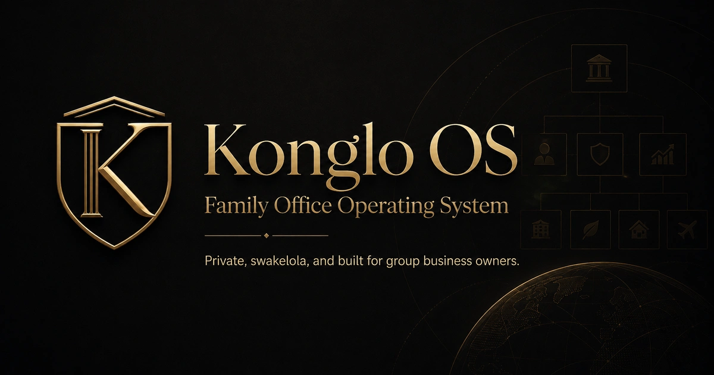
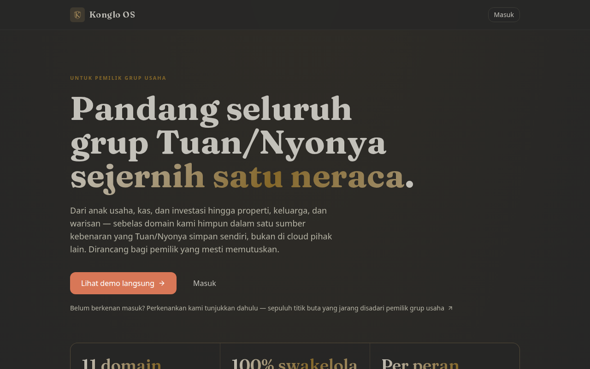
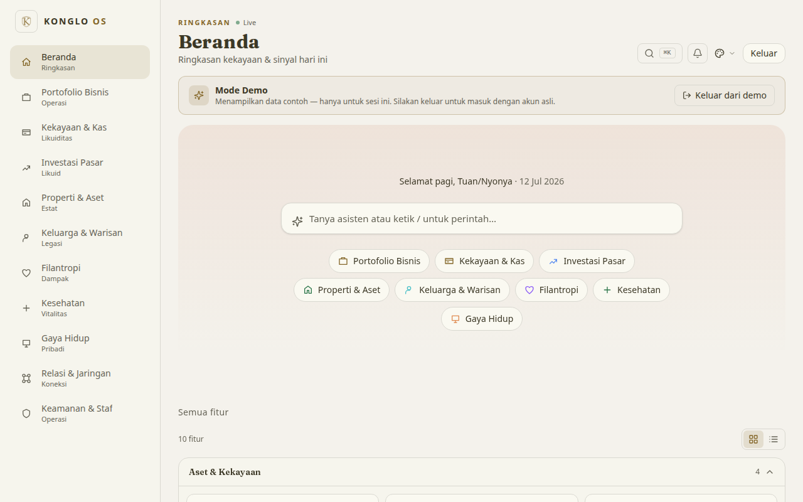
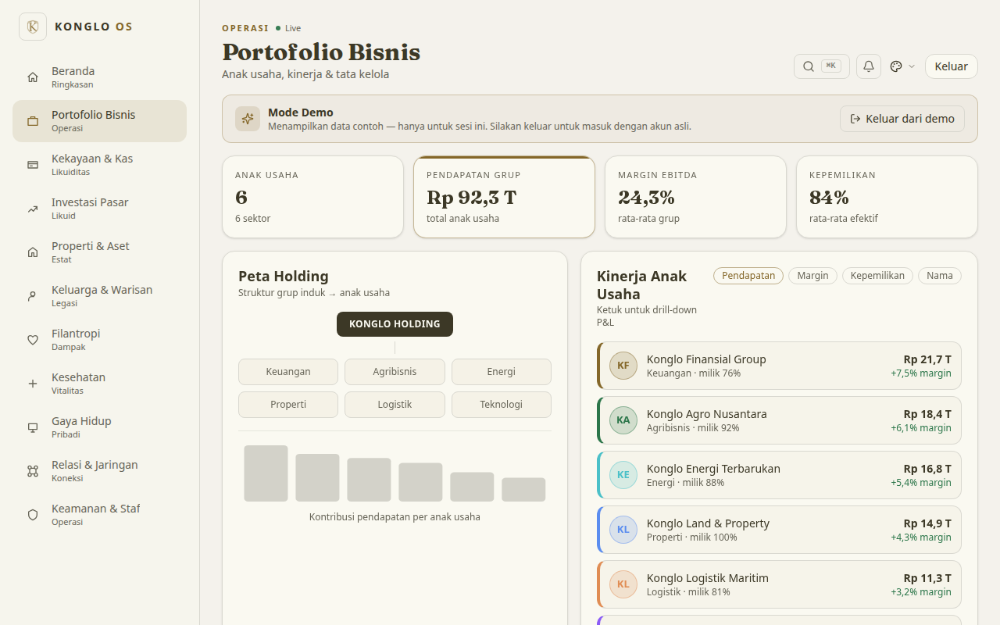
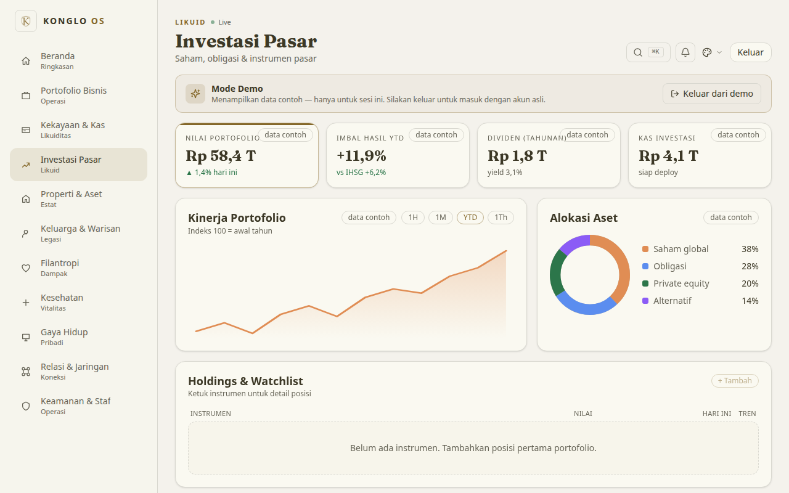
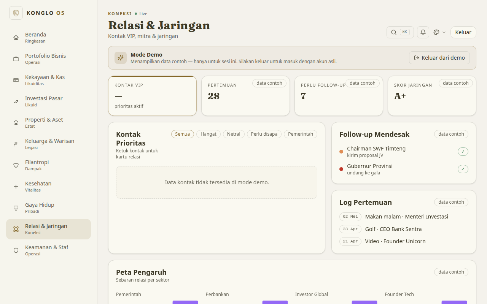
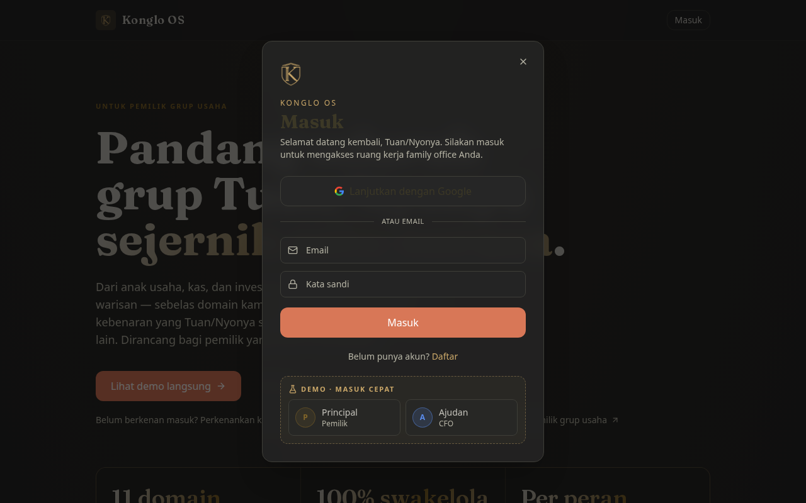
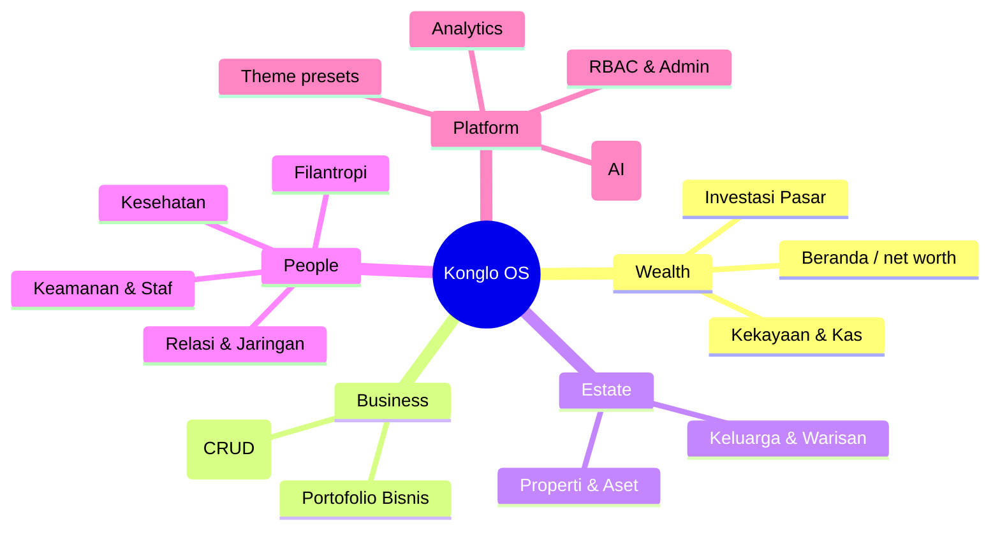
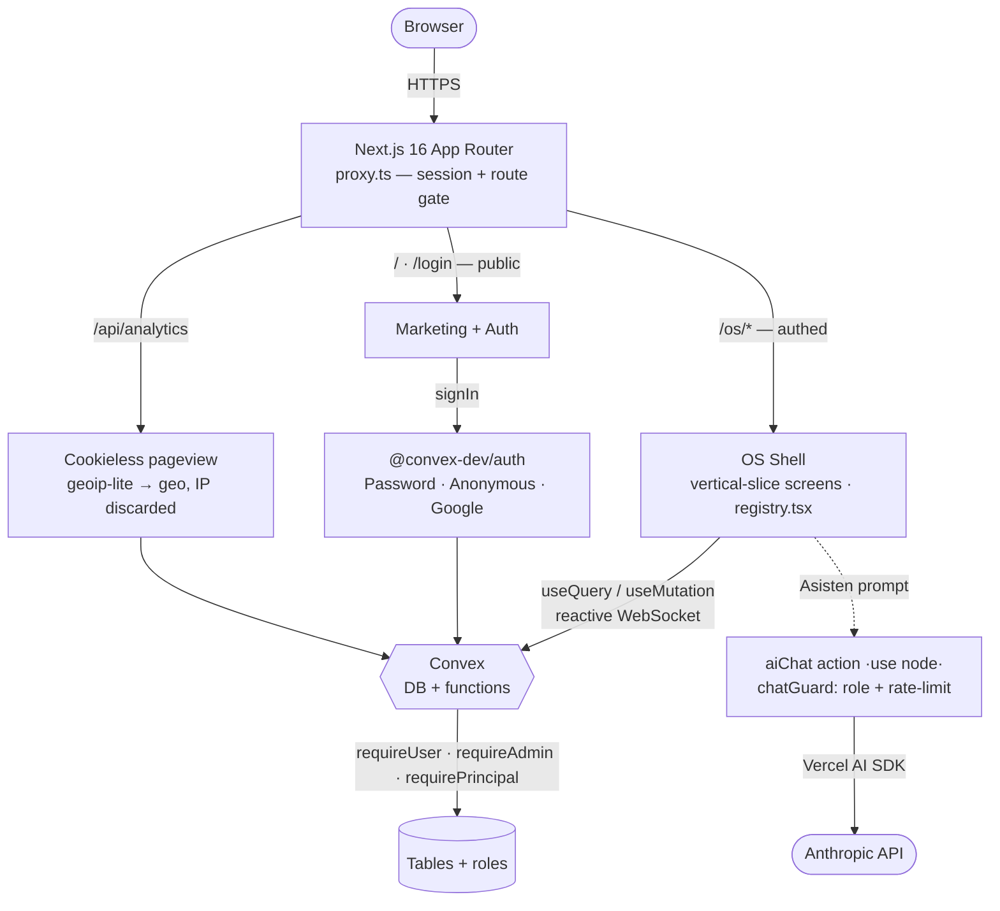

<div align="center">

# Konglo OS

**A private family-office operating system.**

One real-time, iOS-flavored workspace that unifies a family's entire wealth —
businesses, cash, markets, property, succession, philanthropy, health and staff —
behind server-enforced role-based access and a deferential AI *ajudan* (aide).



[](LICENSE)


[**Live demo**](https://konglo.rahmanef.com) · [Features](#-features) · [Architecture](#-architecture) · [AI roadmap](#-ai-integration--roadmap) · [Quickstart](#-quickstart)

</div>

> **What it is.** Most wealth dashboards are cloud SaaS you must trust with your
> most sensitive data. Konglo OS is the opposite: a self-hostable, single-tenant OS
> where the data lives on *your* infrastructure, access is enforced on the server
> (not hidden in the UI), and the succession plan is principal-only by construction.
> The seed data here is a **fictional** conglomerate — a capability showcase, not a
> real family's books.

---

## 📸 Screenshots

Dark-luxury, iOS-flavored. Captured live from the [**demo**](https://konglo.rahmanef.com)
(sign in as *"Lihat demo langsung"* for read-only mock data — a fictional conglomerate).

<table>
  <tr>
    <td width="50%"><br/><sub><b>Landing</b> — cinematic marketing page</sub></td>
    <td width="50%"><br/><sub><b>Beranda</b> — AI launcher + today's signals</sub></td>
  </tr>
  <tr>
    <td width="50%"><br/><sub><b>Portofolio Bisnis</b> — subsidiaries, holding map, live P&L</sub></td>
    <td width="50%"><br/><sub><b>Investasi Pasar</b> — performance, allocation, holdings</sub></td>
  </tr>
  <tr>
    <td width="50%"><br/><sub><b>Relasi & Jaringan</b> — VIP contacts, follow-ups, meeting log</sub></td>
    <td width="50%"><br/><sub><b>Login</b> — Google · Password · Anonymous demo</sub></td>
  </tr>
</table>

<sub>The shell is fully responsive — on phones it collapses to a native-iOS layout
(fixed-viewport scroll, 5-slot dock with a center Asisten button).</sub>

---

## ✨ Features

Eleven wealth domains plus a data studio, an AI assistant, and analytics — each a
self-contained vertical slice.

| Domain | What it does |
| --- | --- |
| **Beranda** | Home dashboard — real-time net-worth headline, portfolio allocation, today's rule-based signals |
| **Portofolio Bisnis** | Subsidiary / operating-company registry (revenue, margin, ownership, trend, governance) |
| **Kekayaan & Kas** | Wealth & liquidity — cash flow, accounts, net-worth figures |
| **Investasi Pasar** | Market holdings (stocks, bonds, instruments) with weights, sectors, sparklines |
| **Properti & Aset** | Estate registry — real estate, vehicles, valuables with status & maintenance |
| **Keluarga & Warisan** | Family, trust & succession plan (heirs / *ahli waris*, readiness, mandates) — **principal-only** |
| **Filantropi** | Foundation programs / grants plus measured cross-program impact |
| **Kesehatan** | Concierge medical team, appointment schedule, daily health programs |
| **Gaya Hidup** | Lifestyle events + a concierge (jet / yacht / resto / tickets) request desk |
| **Relasi & Jaringan** | VIP contact directory, tiered by category and relationship warmth |
| **Keamanan & Staf** | Staff roster, per-property security zones, CCTV / gate / patrol / panic metrics |
| **Studio Data** | Notion-style generic CRUD over every business table — column validators, select options, optimistic-concurrency edits |
| **Asisten** | AI chat aide, opened from the launcher search and the mobile dock's center button |
| **Pengaturan** | Data management (load / replace / clear sample data), full-dataset version history, owner honorific (Tuan / Nyonya) |
| **Admin & Akses** | User & role management (grant / revoke principal / cfo / staf) |

Plus: theme presets (light / dark / system + per-preset radius), first-run onboarding,
cookieless privacy-preserving analytics, and a read-only **demo mode** backed by
in-code mock data that never touches real records.

### Feature domains at a glance



---

## 🏗 Architecture

Next.js 16 App Router with `proxy.ts` (not `middleware.ts`) as the route gate,
talking to a reactive Convex backend over a websocket. Every server function is
auth-gated; the AI path and analytics are isolated.



**Request flow.** `proxy.ts` runs on every non-static request: it serves `/api/auth`,
refreshes the session cookie, then gates routes — `/` and `/login` are public, `/os/*`
requires a session (else redirect to `/login`). The shell lazily code-splits each menu
slug to a client screen. Client components call Convex via React hooks; every public
function validates its `args` with `v.*` and calls `requireUser` / `requireAdmin` /
`requirePrincipal` before touching data. `rbac.me` resolves the caller's role and flags
anonymous demo sessions. The Asisten action authenticates first, then a `chatGuard`
mutation (role check + per-user rate limit) runs before calling Anthropic.

---

## 🔐 Roles (RBAC)

Access is enforced **server-side** in every Convex function — the UI merely reflects
what the server already permits. SSOT: `lib/roles.ts` + `convex/_shared/auth.ts`.

| Capability | `principal` (owner) | `cfo` (ajudan) | `staf` | demo / anon |
| --- | :---: | :---: | :---: | :---: |
| Beranda, business & wealth screens | ✅ | ✅ | — | read-only mock |
| Studio Data CRUD (business tables) | ✅ | ✅ | — | — |
| Keluarga & Warisan (succession / heirs) | ✅ | 🚫 hidden + blocked | — | — |
| Security & staff (Keamanan) | ✅ | — | ✅ | — |
| Settings, data management, version history | ✅ | — | — | — |
| Admin — grant / revoke roles | ✅ | — | — | — |

> **SEC-001.** `cfo` is deliberately the business-table DB admin via Studio Data —
> but `heirs` carries a `sensitivity: "principal"` flag, so the generic CRUD layer
> *also* calls `requirePrincipal` for it. The admin surface is not a back door into
> the estate plan. Covered by `tests/convex/authz.test.ts`.

---

## 🤖 AI integration & roadmap

The Asisten is a deferential Indonesian aide that addresses the owner by their chosen
honorific (Tuan / Nyonya) and frames answers around the family's holdings.

**Shipped today**

- **Asisten AI chat** — a stateless Convex `use node` action using the Vercel AI SDK
  + `@ai-sdk/anthropic` (`claude-haiku-4-5`), guarded on `ANTHROPIC_API_KEY` (degrades
  gracefully with a notice when the key is unset).
- **Security gate** — an internal `chatGuard` mutation rejects role-less callers and
  applies a per-user rate-limit token bucket (~30 replies / 10 min) so the API budget
  can't be drained.
- **Launcher entry point** — the OS launcher search box *is* the AI prompt (with `/`
  and `@` affordances); the mobile dock's center button opens Asisten. `@`-mentions of
  entities are treated as referenced context.
- **Deterministic "Today's Signals"** — a *non-LLM*, rule-based decision layer
  (leverage thresholds, concentration, sub-supermajority control, margin compression)
  that can't hallucinate because it never calls a model.

**Roadmap**

- [ ] **Persistent threads** — store conversation history & follow-ups (currently stateless).
- [ ] **Tool-calling / RAG on live tables** — ground replies in real figures (net worth,
      subsidiary revenue, cash) instead of general knowledge, with citations.
- [ ] **Streaming responses** in the chat UI.
- [ ] **Proactive insights** — portfolio / estate anomaly alerts, and natural-language
      edits to Studio Data.
- [ ] **MCP server** — expose Konglo tools to external assistants (ChatGPT / Claude connectors).

---

## 🧱 Tech stack

- **Next.js 16** (App Router, `proxy.ts`), **React 19**
- **Tailwind CSS v4** via `@tailwindcss/postcss` — no `tailwind.config`; `@theme` tokens in `app/globals.css`
- **Convex** — reactive DB + queries / mutations / actions (`_generated` committed)
- **@convex-dev/auth** — Password + Anonymous + env-gated Google OAuth; `@convex-dev/rate-limiter`
- **Vercel AI SDK** + `@ai-sdk/anthropic` for the Asisten
- **radix-ui** + shadcn-style primitives, `lucide-react`, `next-themes` + vendored tweakcn presets
- **TypeScript 5** (strict), **pnpm**, **Vitest 3** (jsdom + convex-test) and **Playwright** e2e
- Ships as a standalone Docker image (`output: "standalone"`) — deploy anywhere

---

## 🚀 Quickstart

```bash
pnpm install
npx convex dev --once --local     # bootstrap a local Convex + generate types
pnpm dev                          # http://localhost:3000
```

Copy `.env.example` → `.env.local` and set your Convex URLs. For production, pass
`NEXT_PUBLIC_CONVEX_URL` / `NEXT_PUBLIC_CONVEX_SITE_URL` as **build args** (they're
baked into the client bundle) and set your owner email via `PRINCIPAL_EMAIL`. Google
OAuth is optional and env-gated. See [`CONTRIBUTING.md`](CONTRIBUTING.md) for the
commit gate and deploy notes.

### Seed accounts

The seed creates `konglo@mail.com` (principal) and `ajudan@mail.com` (cfo); the
password is supplied at seed time via env, never committed. `DEMO_MODE=1` renders a
quick-login on `/login` — handy for a public showcase, but it publishes the demo
password, so keep it **off** for any real tenant.

---

## 🗂 Project structure

```
app/                      Next routes — /, /login, /os, /pendekatan, /api/*
proxy.ts                  session refresh + route gating (not middleware.ts)
frontend/
  slices/<slug>/          one feature per folder — registry.tsx + menu.ts SSOT
  shared/                 cross-slice UI barrel (@/frontend/shared)
convex/
  features/<slug>/        schema.ts + queries.ts + mutations.ts per feature
  _shared/                requireUser / requireAdmin / requirePrincipal, db helpers
  schema.ts               table definitions
lib/                      roles.ts (RBAC SSOT) · format.ts (id-ID Rupiah) · utils.ts
tests/                    vitest — lib, jsdom components, convex-test (RBAC / authz)
```

---

## 🧪 Testing

```bash
pnpm test           # full vitest run (lib + jsdom components + convex)
pnpm test:convex    # convex-test suite only (queries / mutations / RBAC)
```

---

## 📬 Contact

Questions, a live walkthrough, or an engagement — reach out:
**[rahmanef63@gmail.com](mailto:rahmanef63@gmail.com)**.

## 📄 License

[MIT](LICENSE) © rahmanef63. The code is yours to use, fork and adapt. It ships with
fictional showcase data only — no real family's records are included.
